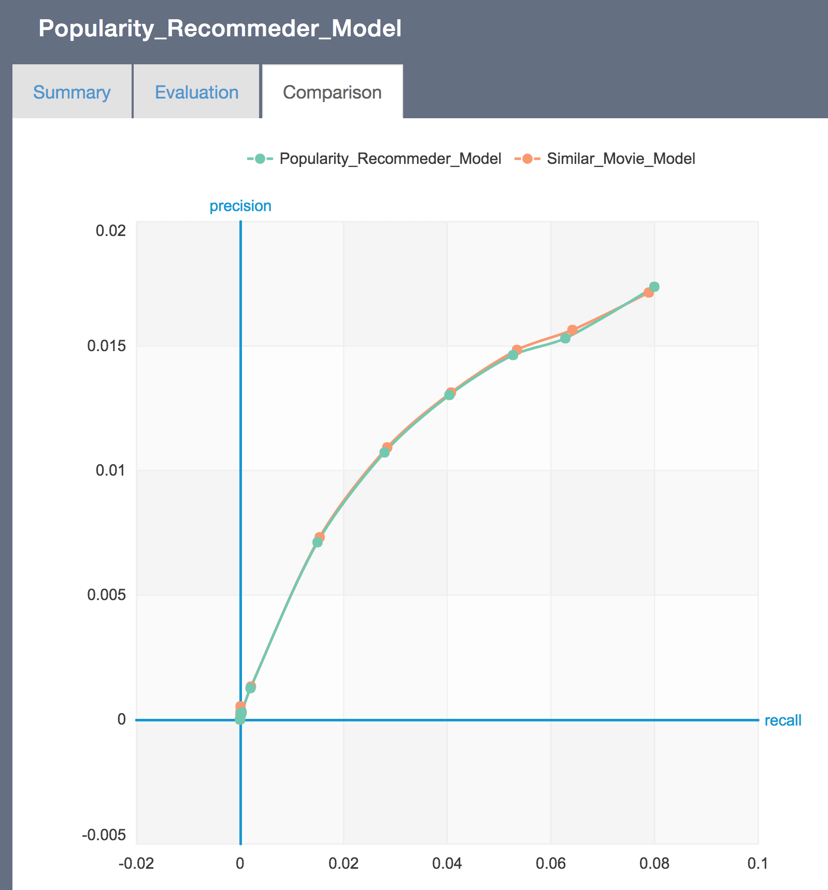

# Movie_Recommender_Engine

A recommender engine for movies based on popularity and item similarity models.

## Requirements
1. Python 2.7
2. Pandas
3. Numpy
4. Graphlab

## Graphs and Evaluation results

### Summary Graph

### Evaluation Graph

### Comparision Graph

The precision vs. recall graph of Popularity_Recommeder_Model and Simalar_Movie_Model

